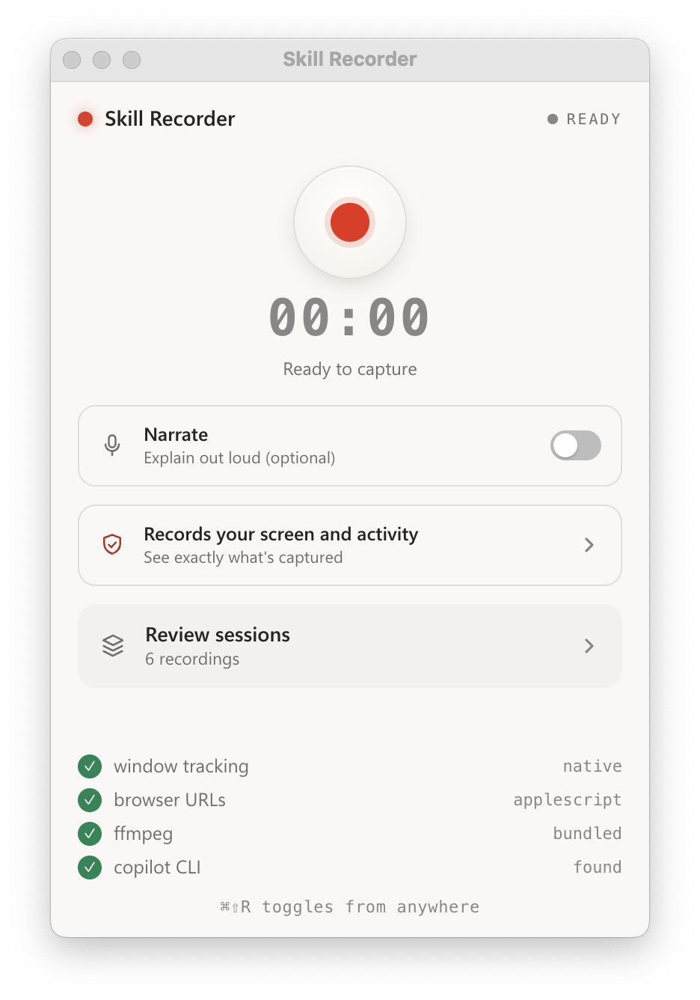
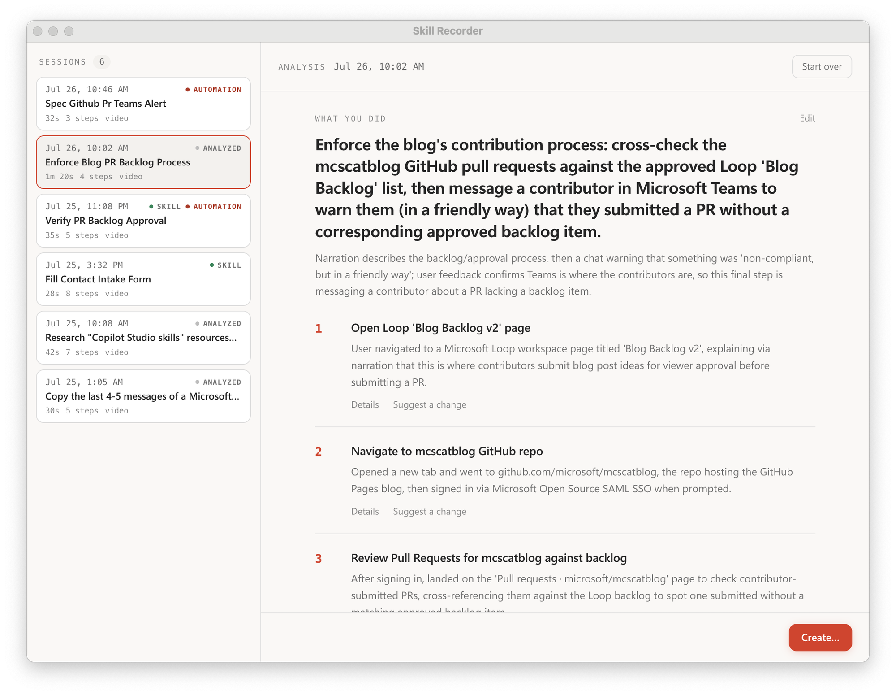

# Skill Recorder

Record a real work session on your screen, and turn it into a reusable **skill** or
**automation** for an AI agent. Skill Recorder captures what you did — screen video
plus activity signals — then uses the GitHub Copilot CLI to reconstruct it into a
clear **intent + ordered steps**, which you can generalize into something an agent
can repeat.

<p align="center">
  
  &nbsp;&nbsp;
  
</p>

## What it does

1. **Record** — hit record (or `⌘⇧R` / `Ctrl+Shift+R` from anywhere) and do your task.
   Skill Recorder captures the screen and your activity in the background.
2. **Analyze** — on stop, it correlates the signals and a Copilot agent reconstructs
   *what you did*: one overall intent plus an ordered list of steps. You can review
   and edit the result.
3. **Create** — from an approved analysis, generalize the one run into a:
   - **Skill** — a `SKILL.md` procedure an agent runs on demand, and
   - **Automation** — the same procedure on a schedule/trigger.

   Both prefer the agent's **native tools** (e.g. the `gh` CLI, `web_fetch`) over
   replaying UI clicks, and generalize from your single example (e.g. "submit one form
   per row" for *all* N rows, not the 3 you happened to record).

## What's captured

Everything is captured and processed **locally**. The in-app "Records your screen and
activity" panel shows exactly what's collected:

- **Window tracking** — active-app / window switches (native, via `get-windows`).
- **Browser URLs** — the page you're on (macOS, via AppleScript).
- **Screen video** — recorded with a bundled `ffmpeg`; frames are pulled only at
  meaningful moments to disambiguate the steps.
- **Clipboard** — copy/paste content that ties steps together.
- **Narration** *(optional)* — turn on **Narrate** to explain out loud; audio is
  transcribed **on-device** (Whisper via transformers.js) and never leaves your machine.

## Requirements

- **macOS** (primary target). Core recording is also validated on Windows 11; see
  [`WINDOWS-VALIDATION.md`](WINDOWS-VALIDATION.md).
- **Node.js 22+**.
- **GitHub Copilot CLI** installed and signed in — the `copilot` command must be on
  your `PATH`. This powers the analysis and the skill/automation builders.
- `ffmpeg` is **bundled** — no separate install needed.

On first launch macOS will prompt for **Screen Recording** (required) and, if you use
Narrate, **Microphone** permission.

## Run it (development)

> There is no packaged/released download yet — run it from source.

```bash
npm install
npm run dev
```

`npm run dev` starts Vite and launches the Electron app with hot-reload. The app also
lives in the menu-bar tray; `⌘⇧R` (macOS) / `Ctrl+Shift+R` (Windows) toggles recording
from anywhere.

Other useful scripts:

```bash
npm run typecheck   # tsc --noEmit
npm run build       # typecheck + production build (dist/ + dist-electron/)
npm run dist        # build a distributable via electron-builder (dmg/zip on macOS)
npm start           # run the last build with `electron .`
```

## Evals

The variable part of the system — the Copilot **describer** and **builders** — has a
fixture-based eval suite. See [`evals/README.md`](evals/README.md).

```bash
npm run eval            # score the describer against synthetic recordings
npm run eval:builder    # score the skill/automation generalization
```

## License

[MIT](LICENSE)
